# glTF Tools Extension for Visual Studio Code

[](https://github.com/AnalyticalGraphicsInc/gltf-vscode/issues) [](https://github.com/AnalyticalGraphicsInc/gltf-vscode/blob/master/LICENSE.md) [](https://marketplace.visualstudio.com/items?itemName=cesium.gltf-vscode)

## Preview and debug glTF 3D models directly in the editor

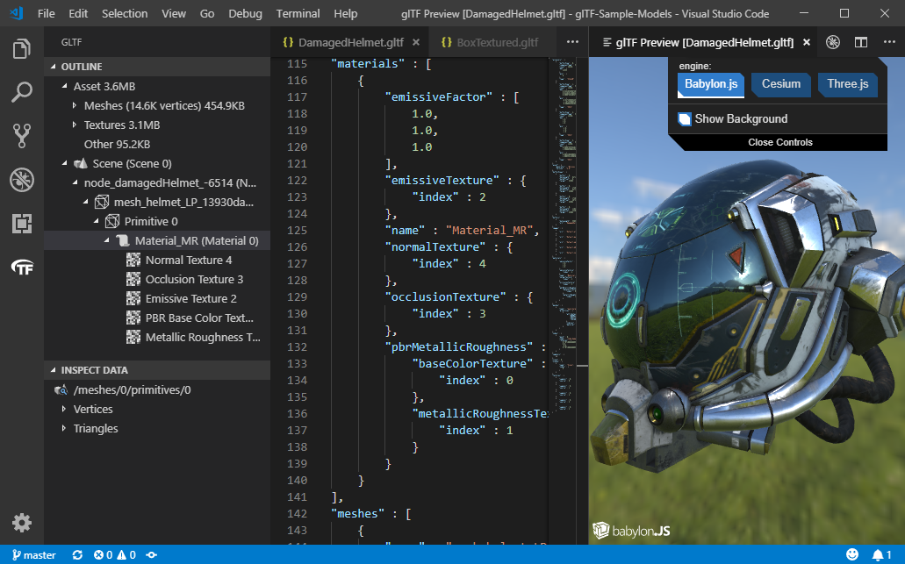

Command name: `glTF: Preview 3D Model`, default key binding: <kbd>ALT</kbd> + <kbd>G</kbd>

The above model, other sample models, and associated licenses can be obtained from the [glTF-Sample-Models](https://github.com/KhronosGroup/glTF-Sample-Models) repository.

You can preview glTF files in a number of different rendering engines: BabylonJS, Cesium, and ThreeJS.  The ThreeJS engine will preview the saved model as opposed to the current content in your open VS Code tab.  The Babylon and Cesium engines will first try to preview what is currently in your tab, and only if that fails will it fall back on displaying the version of the model saved on disk.

## Installing the glTF Tools Extension

Once you have [Visual Studio Code](https://code.visualstudio.com/) installed, the next steps are simple:

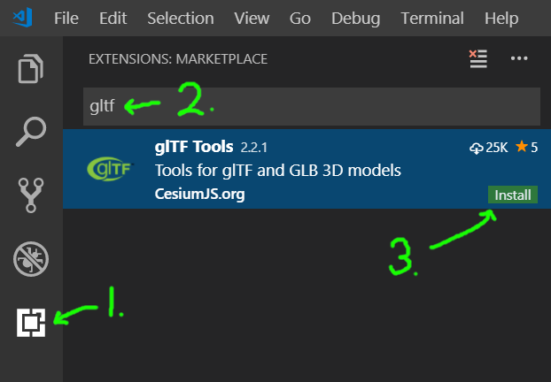

If you wish to build this from source code, see [Developer Environment](CONTRIBUTING.md#developer-environment).

## Export text-based `.gltf` file and all its resources to binary `.glb` file.

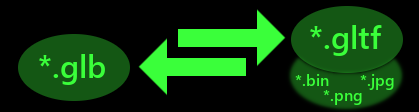

Command name: `glTF: Export to GLB (Binary file)`

The glTF 3D model format comes in two varieties: `*.gltf` is a JSON-based text file, easily editable with this VS Code extension, often with references to external files such as texturemaps and binary mesh data.  `*.glb` is a binary version, typically smaller and self-contained, but not easily editable.

The `glTF: Export to GLB (Binary file)` command will export your text-based glTF from the editor to a binary `.glb` file.  In the exported version, whitespace in the JSON is stripped out, external file references are read in and converted to GLB binary bufferViews, and the resulting file becomes a self-contained transportable file that can be easily shared.

## Import a binary `.glb` file as text-based `.gltf`

Command name: `glTF: Import from GLB`

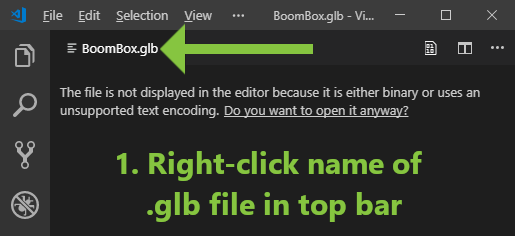

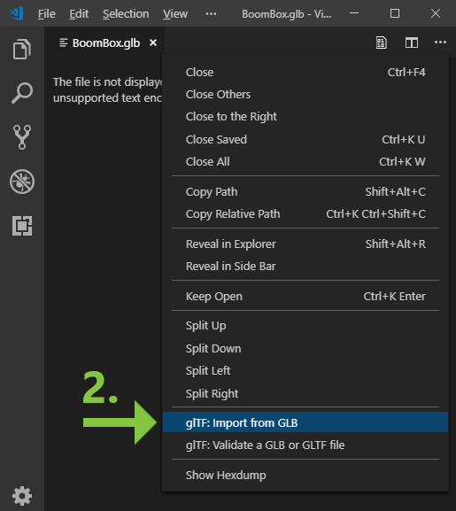

The `glTF: Import from GLB` command will convert a binary `.glb` to JSON-based `.gltf` for editing, creating a separate file for the binary and additional files for each of the included images.  Note that during import, some filenames are calculated based on the target filename of the output `.gltf`.  For example, importing a sample file `BoomBox.glb` to `.gltf` may create the following files:

* `BoomBox.gltf` - The JSON structure.
* `BoomBox_data.bin` - The binary mesh data
* `BoomBox_img0.png` - Image file(s) extracted from the GLB
* `BoomBox_img1.png`
* `BoomBox_img2.png`
* `BoomBox_img3.png`

The user is given a "Save As..." dialog for the base `.gltf` output filename only.  The other files are saved to the same folder with names calculated by appending to the user's selected base name, and any pre-existing files with the same name will be overwritten.

## Inspect data from files or data-URIs

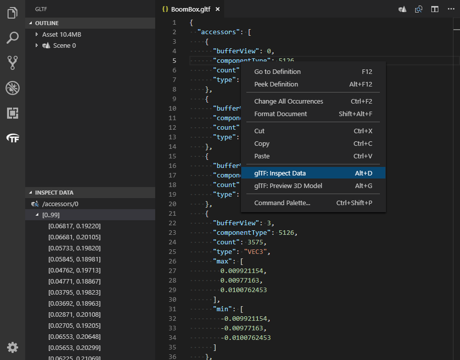

Command name: `glTF: Inspect Data`, default key binding: <kbd>ALT</kbd> + <kbd>D</kbd>

Above, the user is inspecting the first accessor that is part of the `BoomBox.gltf` model from the official sample model repository.  Place the document cursor on shaders, images, accessors, or mesh primitives then select the `glTF: Inspect Data` command to inspect the data.  The command works for files or data-URIs.

If you plan to preview GLSL shader code, consider installing a 3rd-party syntax highlighter with support for the `*.glsl` extension, for example [Shader Language Support for VSCode by slevesque](https://marketplace.visualstudio.com/items?itemName=slevesque.shader), to enable syntax highlighting in shader previews.

## Tree View of Scene Nodes

When editing a glTF file, an icon with the glTF logo is visible in the left bar.  This outline view reveals the structure of the glTF file and its internal references.  This is a different structure than the plain JSON outline that keeps objects grouped by type.

You can also inspect the vertex and triangle data from a selected mesh primitive.

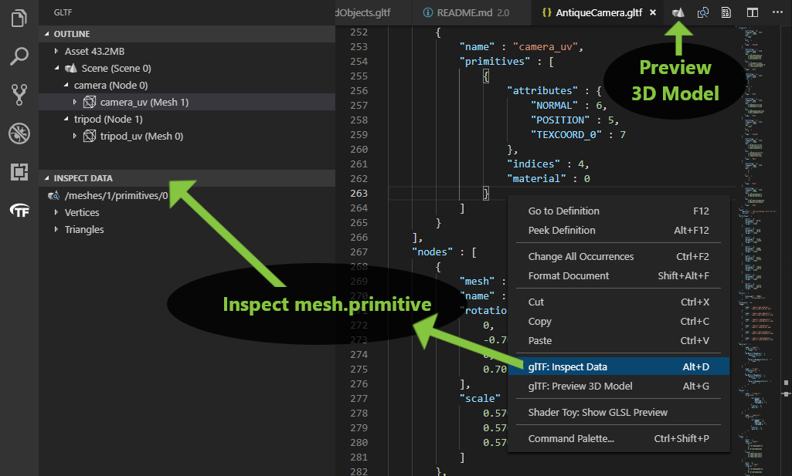

# glTF Debugging

Debugging mesh primitive data can be achieved by opening the preview window at the same time as inspecting the mesh primitive data.

_Note that this feature is currently only supported when Babylon.js is the rendering engine._

For example, selecting a vertex will show the axes for that vertex. If multiple vertices are selected, each vertex will show an axes.

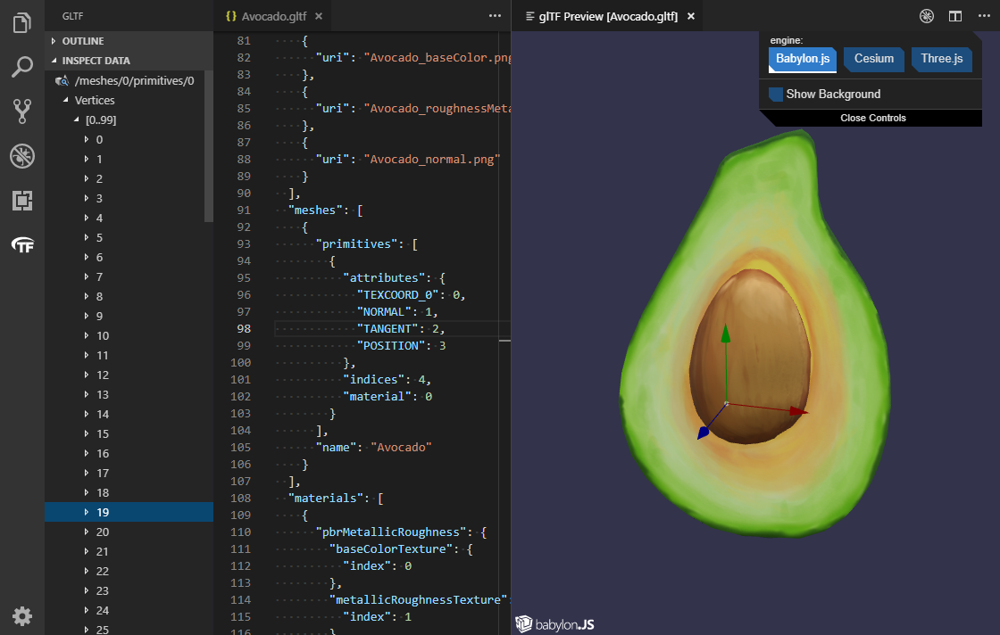

Here is an example of selecting triangles.  Multi-select is available by holding down <kbd>SHIFT</kbd> and using the arrow keys.

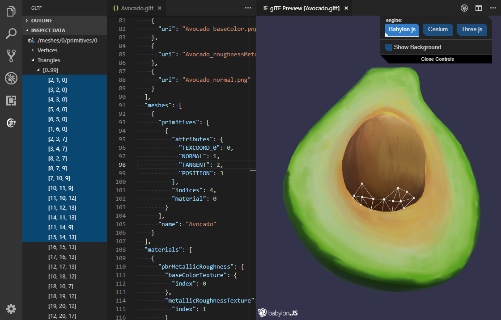

## BabylonJS Inspector integration

When previewing a model with the BabylonJS engine, click the little debug icon at the top to activate the Inspector.  This inspector has been recently added, and not all of its tools are working inside of VSCode at this time.  But, it can show model wireframes, point clouds, normal vectors, individual texture channels, and even allow temporary re-positioning of model nodes (although position changes are not copied back to the glTF document in this version).

See the [Babylon Inspector Documentation](https://doc.babylonjs.com/features/playground_debuglayer) for more information about this tool.

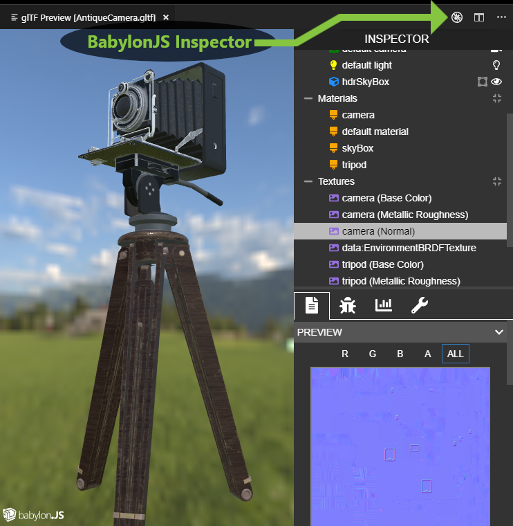

## glTF Validation

Files can be validated three different ways:

* The official [Khronos glTF Validator](https://github.com/KhronosGroup/glTF-Validator) runs automatically on glTF 2.0 files, and reports any issues it finds to the document's "Problems" window.  All such messages are marked with a `[glTF Validator]` prefix.  This goes far beyond simple JSON validation, as it reads in external data and image files, and looks at mesh data itself for errors such as non-normalized normal vectors and inaccurate bounding volumes.

* The same glTF Validator can also run as a manual process, by issuing the command `glTF: Validate a GLB or GLTF file`.  This can be done by right-clicking a file in the VSCode File Explorer sidebar, or just running the command stand-alone to open a file dialog.  This is the only method in this extension to validate GLB files directly, without conversion.  A summary of the validation report appears in a popup, along with an option to save the JSON report.

* The glTF JSON schema is registered with VSCode for `*.gltf` files, and VSCode will find schema violations using its own JSON schema validation, without help from the glTF Validator.  This produces messages in the "Problems" window that *are not* marked `[glTF Validator]`.  This is less thorough than full glTF validation, but is the only method available to glTF 1.0 files.

In the screenshot below, the Khronos glTF Validator is displaying one `error`, one `warning`, and one `info`.  If you see these in your own files, you can click a line in the bottom window to scroll to the source of the message.  In case of errors in binary data, the editor will scroll to the glTF accessor that references that data.

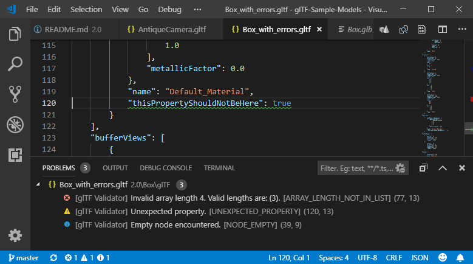

Even if the "Problems" window is not visible, some icons down in the bottom footer show a summary of the validation messages.  Click these icons to reveal the "Problems" window.


## "Quick Fixes" for Specific Validator Codes

Certain messages supplied by the Khronos glTF Validator will be accompanied by an offer of a "Quick Fix" from this VSCode extension.  This may appear as a blue lightbulb in the text editor, a link in a hover popup, and/or a menu on the icon in the "Problems" window.  Activate the "Quick Fix" for this extension's best effort to apply automated correction the problem identified by the Validator.  As with all features of this software, the user assumes all risk associated with its use.  Please make a backup of any important files before using this software.

### &bull; UNDECLARED_EXTENSION

When adding new extensions into a glTF file, the Validator may report this code on any extension not declared in the glTF `extensionsUsed` block.  The Quick Fix for this is called "Add Extension to 'extensionsUsed'", and will attempt to locate or create the `extensionsUsed` block, and add the name of the selected extension.  The user may not notice the resulting edit to the document, which potentially happens far from the active cursor position, but it should be apparent that it worked because the validation message will immediately disappear.  This is a JSON-only change.

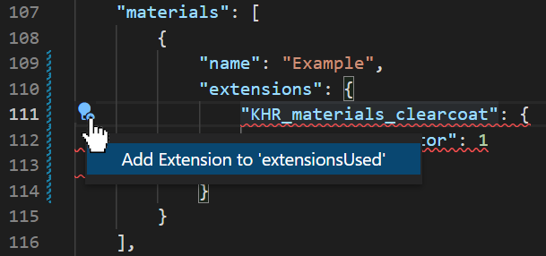

### &bull; BUFFER_VIEW_TARGET_MISSING

By default the glTF Validator offers only the lowest-severity hints about targets missing from bufferViews.  This is a fairly deep feature of glTF that most users don't need to directly edit or understand, yet it is still best practice to set these values correctly in the JSON document.  There are two "Quick Fixes" offered here:  "Add target for this bufferView" and "Add all needed targets for all bufferViews in this file."  These will correct the problem for one or multiple bufferViews accordingly.  This is a JSON-only change that can be undone with a single "Undo" command in the editor during the same editing session.

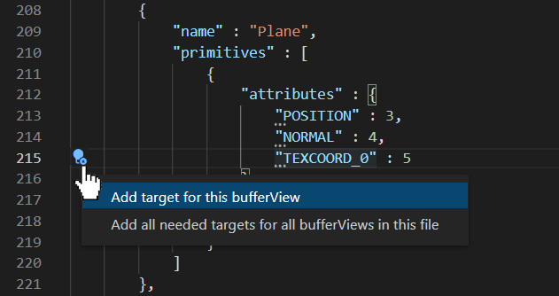

### &bull; ACCESSOR_JOINTS_USED_ZERO_WEIGHT

This validation message relates to skinned meshes, indicating where particular joints are called out with zero weight, meaning they have no influence on the final result.  The "Quick Fix" here is called "Clear Joint IDs with Zero Weight" and will attempt to remove this validation warning by zeroing-out the unused joint IDs.  **NOTE**: The next thing that will happen is a save file dialog will open up.  The edits needed for this fix take place in the binary data, typically an external `*.bin` file referenced by the `buffers` section of the glTF.  The save dialog is asking to save an updated copy of this binary data to a new `.bin` file containing the adjustments to the joint IDs.  The new file must be placed in the same folder as the `*.gltf` file.

The default name for the updated file will typically have `*_patch1.bin` added on the end, but this is adjustable in the save file dialog.  Saving to this new filename allows the updated bin file to coexist with the original, in case comparison or "Undo" is needed afterwards.  The `buffers` section of the JSON document will be edited such that the `uri` field indicates the newly-chosen filename.  The editor's built-in "Undo" and "Redo" features will apply only to this tiny edit of that buffer's `uri` field, but that is enough to direct the Validator's efforts at either the old or new binary data as appropriate, so you should see the validation messages reappear on "Undo" and be dismissed again with "Redo."

**WARNING**: If you overwrite an existing file, the editor's "Undo" feature **cannot** undo the action.

## Convert files to and from Data URIs

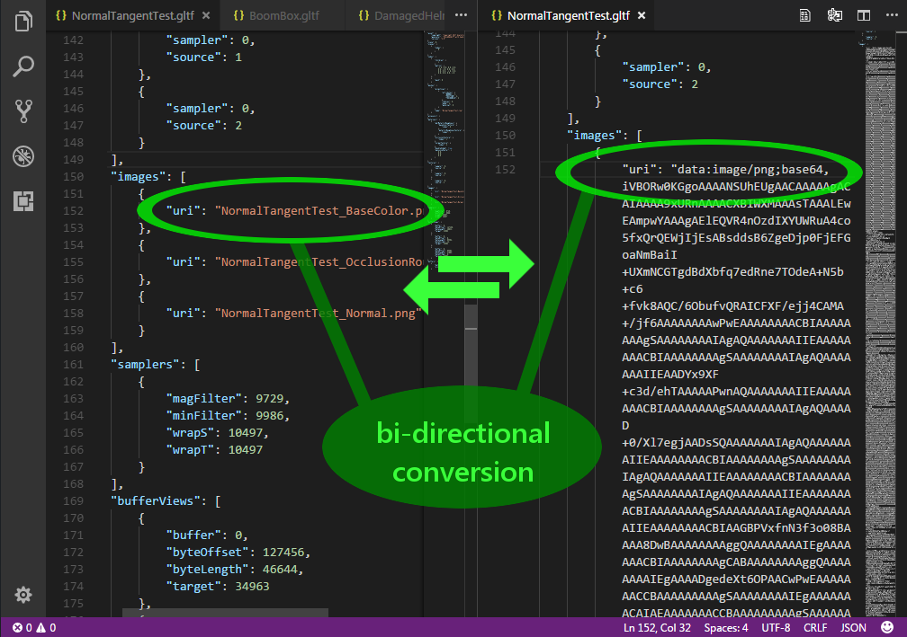

In the list of commands (<kbd>CTRL</kbd> + <kbd>SHIFT</kbd> + <kbd>P</kbd>), there are two commands named `glTF: Import file as Data URI` and `glTF: Export a Data URI to a file`.  To use these, place the document cursor on a block that contains a `"uri"` field.  If the value of this field is a valid filename, `Import` will load that file, encode it to base64, and replace the filename with the dataURI in your document.  `Export` is the reverse of this process, but first it will ask you for a filename to save to.  It will save the file in the same folder as the glTF file, so it does not need a path, just a name.  It will try to select an appropriate file extension based on the MIME type of the dataURI.  It will also warn you if you are about to overwrite an existing file.  If the save is successful, the dataURI will be replaced by the name of the newly created file.

## Other Features

### &bull; `Go to Definition` command works for all indexed glTF references

Place the cursor on the 3 in `"POSITION": 3` and press <kbd>F12</kbd> to navigate to the defining Accessor.

### &bull; Tooltips for glTF enum values

Hover the mouse over a numeric enum to see its meaning.

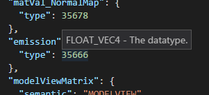

### &bull; Autocomplete for glTF enum values

Press <kbd>CTRL</kbd> + <kbd>SPACE</kbd> on a blank field to pop up a list of suggested values.  As you scroll through the list, the meaning of the selected value is revealed.

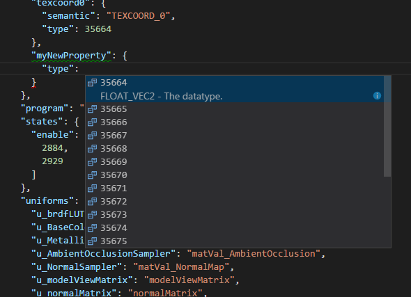

This works for arrays as well, for example the list of enabled render states.  Here for example, a user is looking to enable a BLEND state.

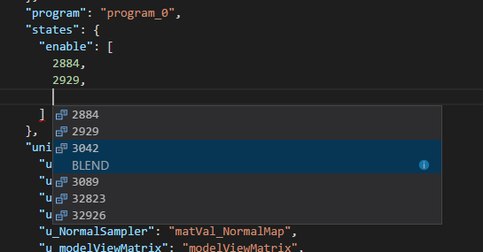

### &bull; Animation editor

Press <kbd>ALT</kbd> + <kbd>i</kbd> on an animation sampler to import values into the glTF JSON.

```json
"samplers": [
{
    "input": 6,
    "interpolation": "LINEAR",
    "output": 7,
    "extras": {
    "vscode_gltf_input": [
        1.25,
        2.5
    ],
    "vscode_gltf_type": "VEC4",
    "vscode_gltf_output": [
        0,
        0,
        0,
        -1,
        1,
        0,
        0,
        4.4896593387466766e-11
    ]
},
```

Modify the `vscode_gltf_input` and `vscode_gltf_output` arrays for your needs and then press <kbd>ALT</kbd> + <kbd>o</kbd> to rewrite the glTF buffer and JSON with new values. This will use a Data URI for the buffer so the changes can be completely undone; `glTF: Export a Data URI to a file` is available if a binary file is required. Save the edited document and use `glTF: Preview 3D Model` to view your changes.

New samplers can be created as well simply use `-1` for the accessor references and new accessors will be automatically created.

## Extension Settings

### Default rendering engines

* `glTF.defaultV1Engine` - Choose the default 3D engine that will render a glTF 1.0 model in the preview window.

* `glTF.defaultV2Engine` - Choose the default 3D engine that will render a glTF 2.0 model in the preview window.

### Reflection Environments

* `glTF.Babylon.environment` - Override the default reflection map for the BabylonJS glTF preview window.  This specifies a local path to a Babylon ENV or DDS pre-filtered environment file, such as one created by following steps in [Use a HDR environment](https://doc.babylonjs.com/how_to/use_hdr_environment), or a raw HDR file (which is slower to load due to runtime pre-filtering).

* `glTF.Three.environment` - Override the default reflection map for the ThreeJS glTF preview window.  This should be the full path and filename of an `*.hdr` environment file, such as one from [HDRI Haven](https://hdrihaven.com/hdris/).  There's a legacy, non-HDR mode, when `{face}` appears in the filename, no longer recommended.  When legacy mode is used, there are 6 cube faces, with face names `posx`, `negx`, `posy`, `negy`, `posz`, and `negz`.  The rest of the path and filename should be identical for all 6 files.  The path and filename are specified as a single string, using `{face}` in place of the face name.  The legacy environment files must be in a format usable on the web, such as PNG or JPEG.

### Files and Folders

* `glTF.showToolbar3D` - Show a button on the toolbar to activate the 3D Preview window.

* `glTF.alwaysOverwriteDefaultFilename` - Certain commands create new files, such as importing and exporting GLBs, exporting a DataURI, and creating a glTF Validation report.  When `true` these files will be saved with their default names, which saves the step of interacting with a file dialog each time, but does make it trivial to overwrite existing files.  It's safer to leave this set to `false`.

* `glTF.expandOutlineWithSelection` - When the editor selection changes, the glTF outline will expand to include the current selection.

### Automatic glTF Validation (only)

* `glTF.Validation.enable` - When true, automatically run the glTF Validator and report any found issues to the document problems window.

* `glTF.Validation.debounce` - The number of milliseconds to wait for multiple automatic requests to re-validate a glTF document.

### Automatic and Manual glTF Validation (shared settings)

* `glTF.Validation.maxIssues` - Controls the maximum number of issues reported by the Khronos glTF Validator (not counting any messages produced by VSCode's own JSON schema validation).

* `glTF.Validation.ignoredIssues` - Array of issue codes to ignore during validation.  The issues should be listed in the array by issue code, such as `ACCESSOR_INDEX_TRIANGLE_DEGENERATE` and `NODE_EMPTY`. See [ISSUES.md](https://github.com/KhronosGroup/glTF-Validator/blob/master/ISSUES.md) for the full list, or run a manual glTF Validation of an existing file with messages reported to see their codes.  For example, to completely disable reporting of empty nodes, one would use: `[ "NODE_EMPTY" ]`

* `glTF.Validation.severityOverrides` - This is a JSON object that maps issue codes (as keys) to severity codes (as values).  The issue codes are the same as for `glTF.Validation.ignoredIssues` above.  The severity codes are: 0 for `error`, 1 for `warning`, 2 for `information`, and 3 for `hint`.  For example, to reduce the severity of empty nodes to `hint`, one would specify: `{ "NODE_EMPTY" : 3 }`

## Supported glTF extensions

Certain glTF 2.0 extensions are supported by JSON schema validation in VSCode.  This means that VSCode will provide hover tooltips, auto-complete (<kbd>CTRL</kbd> + <kbd>space</kbd>), and document problem indications for extension schema violations.  This is separate from (and in addition to) any validation being performed by the official glTF Validator.  The extension schemas shipping with this project currently are:

* `KHR_draco_mesh_compression`
* `KHR_lights_punctual`
* `KHR_materials_clearcoat`
* `KHR_materials_emissive_strength`
* `KHR_materials_ior`
* `KHR_materials_iridescence`
* `KHR_materials_pbrSpecularGlossiness`
* `KHR_materials_sheen`
* `KHR_materials_specular`
* `KHR_materials_transmission`
* `KHR_materials_unlit`
* `KHR_materials_variants`
* `KHR_materials_volume`
* `KHR_texture_basisu`
* `KHR_texture_transform`
* `KHR_xmp`
* `KHR_xmp_json_ld`
* `EXT_lights_image_based`
* `EXT_mesh_gpu_instancing`
* `EXT_meshopt_compression`
* `EXT_texture_webp`
* `AGI_articulations`
* `AGI_stk_metadata`

Support for additional extensions can be requested by filing an issue or pull request to [the GitHub repository](https://github.com/AnalyticalGraphicsInc/gltf-vscode).

## Source code

on [GitHub](https://github.com/AnalyticalGraphicsInc/gltf-vscode).  See [CONTRIBUTING.md](CONTRIBUTING.md).

## Acknowledgements

This extension makes use of the following open source projects:

 * [Babylon.js](https://github.com/BabylonJS/Babylon.js) - One of the 3D engines used in the preview window
 * [Basis Universal](https://github.com/BinomialLLC/basis_universal) - A GPU supercompression format for textures
 * [Cesium](https://github.com/CesiumGS/cesium) - One of the 3D engines used in the preview window
 * [Draco](https://github.com/google/draco) - A mesh compression library from Google
 * [Filament](https://google.github.io/filament/Filament.html) - One of the 3D engines used in the preview window
 * [Knockout](http://knockoutjs.com/) - Used to data-bind preview window's menu
 * [Three.js](https://github.com/mrdoob/three.js/) - One of the 3D engines used in the preview window

## License

Apache 2.0, see [LICENSE.md](LICENSE.md).

## Release Notes

See [CHANGELOG.md](CHANGELOG.md).
