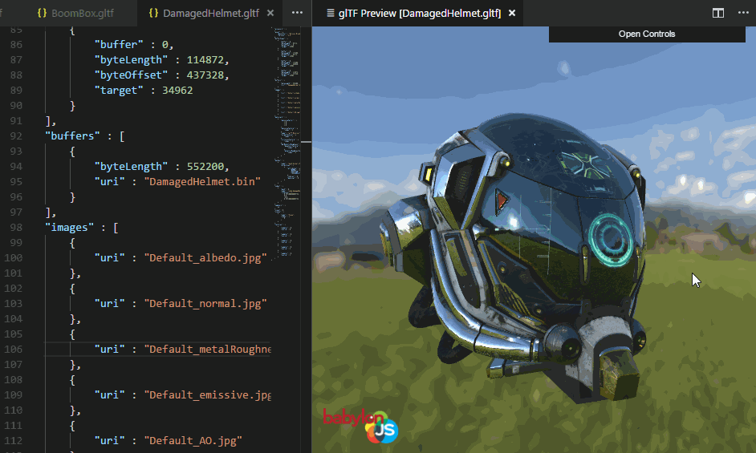
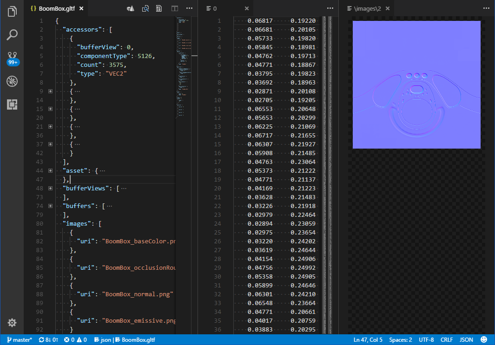

# glTF Extension for Visual Studio Code

   

## Preview glTF 3D models directly in the editor

Command name: `glTF: Preview 3D Model`, default keybinding: <kbd>ALT</kbd> + <kbd>G</kbd>

The above model, other sample models, and associated licenses can be obtained from the [glTF-Sample-Models](https://github.com/KhronosGroup/glTF-Sample-Models) repository.

You can preview glTF files in a number of different rendering engines: BabylonJS, Cesium, and ThreeJS.  The ThreeJS engine will preview the saved model as opposed to the current content in your open VS Code tab.  The Babylon and Cesium engines will first try to preview what is currently in your tab, and only if that fails will it fall back on displaying the version of the model saved on disk.

## Export text-based `.gltf` file to binary `.glb` file.

Command name: `glTF: Export GLB (Binary file)`

The glTF 3D model format comes in two varieties: `*.gltf` is a JSON-based text file, easily editable with this VS Code extension.  `*.glb` is a binary version, typically smaller and self-contained, but not easily editable.  This command will export your text-based glTF from the editor to a binary `.glb` file.  In the exported version, whitespace in the JSON is stripped out, external file references are read in and converted to GLB binary chunks, and the resulting file becomes a self-contained transportable file that can be easily shared.

## Preview image files and data-URIs from inside the glTF document

Command name: `glTF: Inspect Data URI`, default keybinding: <kbd>ALT</kbd> + <kbd>D</kbd>

Above, the user is previewing a normal map that is part of the `BoomBox.gltf` model from the official sample model repository.  The preview works even if the filename is replaced by a `data: ...` formatted URI.  Place the document cursor on a dataURI, or on a block that has been folded closed with a dataURI in its `uri` field, then press <kbd>ALT</kbd> + <kbd>D</kbd> or look for the command `glTF: Inspect Data URI` in VSCode's list of commands (<kbd>CTRL</kbd> + <kbd>SHIFT</kbd> + <kbd>P</kbd>) and use that.

If you plan to preview GLSL shader code, consider installing a 3rd-party syntax highlighter with support for the `*.glsl` extension, for example [Shader Language Support for VSCode by slevesque](https://marketplace.visualstudio.com/items?itemName=slevesque.shader), to enable syntax highlighting in shader previews.

## Convert files to and from Data URIs

In the list of commands (<kbd>CTRL</kbd> + <kbd>SHIFT</kbd> + <kbd>P</kbd>), there are two commands named `glTF: Import file as Data URI` and `glTF: Export a Data URI to a file`.  To use these, place the document cursor on a block that contains a `"uri"` field.  If the value of this field is a valid filename, `Import` will load that file, encode it to base64, and replace the filename with the dataURI in your document.  `Export` is the reverse of this process, but first it will ask you for a filename to save to.  It will save the file in the same folder as the glTF file, so it does not need a path, just a name.  It will try to select an appropriate file extension based on the MIME type of the dataURI.  It will also warn you if you are about to overwrite an existing file.  If the save is successful, the dataURI will be replaced by the name of the newly created file.

## Tree View of Scene Nodes

Command name: `glTF: Tree View of Scene Nodes`

This displays a window with a tree view revealing the node structure of the glTF file.

## Other Features

### &bull; Registers `*.gltf` files as JSON schema

Files are matched against the glTF 1.0 or glTF 2.0 schema, and schema violations are called out in the editor.

### &bull; Tooltips for glTF enum values

Hover the mouse over a numeric enum to see its meaning.

### &bull; Autocomplete for glTF enum values

Press <kbd>CTRL</kbd> + <kbd>SPACE</kbd> on a blank field to pop up a list of suggested values.  As you scroll through the list, the meaning of the selected value is revealed.

This works for arrays as well, for example the list of enabled render states.  Here for example, a user is looking to enable a BLEND state.

## Compatibility and known size limitations

Currently, this extension is compatible only with `*.gltf` files, not the binary form of `*.glb`.  This may change in the future.  [Contributions](CONTRIBUTING.md) welcome!

Also, there is a [known issue](https://github.com/Microsoft/vscode/issues/31078) where VSCode extensions cannot manipulate documents that have grown beyond 5 MB in size.  This limitation applies only to the main JSON-based glTF document, not to external assets such as the `bin` file, texture image files, etc.  The sample model repo contains some models called `glTF-Embedded`, where all of the assets have been URI-encoded and placed inside the JSON document.  For some of the larger models, this does make the document larger than the size limit, preventing this extension's preview windows from opening.  We hope this limit will be increased or made user-configurable in the future.  In the meantime, the workaround is to use the non-embedded versions of those models.  The non-embedded versions are all well below the size limit, because the bulk of their data is external to the JSON.

Note there is now a 64-bit version of VSCode that appears to have a much higher bound for this limit.  For large models, the 64-bit version is strongly recommended over the 32-bit version of VSCode.

## Extension Settings

* `glTF.defaultV1Engine` - Choose the default 3D engine that will render a glTF 1.0 model in the preview window.
* `glTF.defaultV2Engine` - Choose the default 3D engine that will render a glTF 2.0 model in the preview window.
* `glTF.Babylon.environment` - Override the default reflection map for the BabylonJS glTF preview window.  This specifies a local path to a Babylon DDS environment file, such as one created by following steps in [Creating a DDS Environment File From an HDR Image](http://doc.babylonjs.com/overviews/physically_based_rendering#creating-a-dds-environment-file-from-an-hdr-image).
* `glTF.Three.environment` - Override the default reflection map for the ThreeJS glTF preview window.  There are 6 cube faces, with face names `posx`, `negx`, `posy`, `negy`, `posz`, and `negz`.  The rest of the path and filename should be identical for all 6 files.  The path and filename are specified as a single string, using `{face}` in place of the face name.  The files must be in a format usable on the web, such as PNG or JPEG.

## Source code

on [GitHub](https://github.com/AnalyticalGraphicsInc/gltf-vscode).  See [CONTRIBUTING.md](CONTRIBUTING.md).

## Acknowledgements

This extension makes use of the following open source projects:

 * [Cesium](https://github.com/AnalyticalGraphicsInc/cesium) - One of the 3D engines used in the preview window
 * [Babylon.js](https://github.com/BabylonJS/Babylon.js) - One of the 3D engines used in the preview window
 * [Three.js](https://github.com/mrdoob/three.js/) - One of the 3D engines used in the preview window
 * [Knockout](http://knockoutjs.com/) - Used to data-bind preview window's menu

## License

Apache 2.0, see [LICENSE.md](LICENSE.md).

## Release Notes

See [CHANGELOG.md](CHANGELOG.md).
