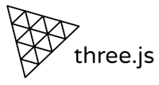

# Three.js 3D Engine

## Geting an updated engine

1. Grab the main (minified) engine from [GitHub](https://github.com/mrdoob/three.js/blob/master/build/three.min.js)

2. Additionally, you need to download
   * The [glTF loader](https://github.com/mrdoob/three.js/blob/master/examples/js/loaders/GLTFLoader.js)
   * The [orbit control](https://github.com/mrdoob/three.js/blob/master/examples/js/controls/OrbitControls.js)

3. Replace the three files with the ones you just downloaded.
